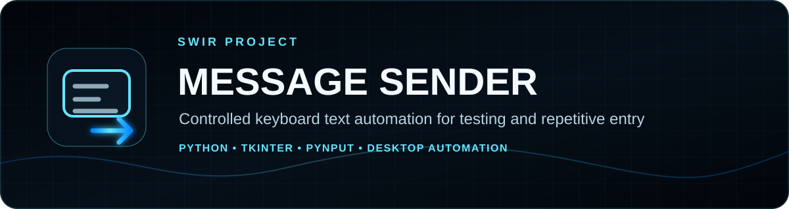
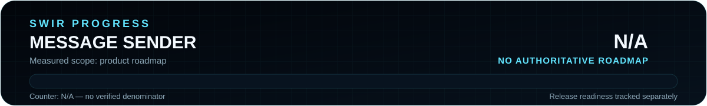

<!-- SWIR-README-STANDARD:v2 -->

<div align="center">



<br>


[](https://github.com/Swir)
[](https://github.com/Swir/Spamer/stargazers)

<br>

[**Highlights**](#-highlights) · [**Quick Start**](#-quick-start) · [**Usage**](#-usage) · [**Progress**](#-progress) · [**Responsible Use**](#-responsible-use)

</div>

# Message Sender

A small Python desktop utility for **controlled keyboard text automation**. It can type a prepared sequence of messages into the currently focused application, repeat the sequence a chosen number of times, and pause between entries.


## 📍 Project Status

<p align="center">
  
</p>

| Item | Status |
|---|---|
| Current stage | Small maintained utility |
| Platform | Desktop Python environment with Tkinter and keyboard input access |
| Latest public release | No GitHub Release published |
| Product roadmap | No authoritative measurable roadmap; product progress is **N/A** |

## 🚀 Overview

Message Sender is intended for repetitive text entry in **your own applications, test environments, demonstrations, accessibility workflows, and other contexts where automated typing is explicitly permitted**. The current implementation exposes six message fields, repeat and delay controls, global `F1` / `F2` hotkeys, a character counter, three ttk themes, and threaded execution so the interface remains responsive while typing runs.

The program sends keystrokes to whichever application currently has keyboard focus. It does not connect to a chat service, account, API, or network endpoint itself.

## ✨ Highlights

| Feature | What it does |
|---|---|
| 💬 Up to six prepared entries | Builds a short ordered sequence of text to type |
| 🔁 Repeat control | Replays the configured message sequence a chosen number of times |
| ⏱️ Delay control | Adds a user-selected pause in milliseconds between submitted entries |
| ⌨️ Global hotkeys | `F1` starts and `F2` stops the current run |
| 🧵 Threaded execution | Keeps the Tkinter window responsive during automation |
| 🔢 Character count | Shows the length of the currently edited entry |
| 🎨 Theme selector | Switches between Ubuntu, Arc and Plastik themes supplied by `ttkthemes` |

## ⚙️ Quick Start

### From source

```bash
git clone https://github.com/Swir/Spamer.git
cd Spamer
pip install ttkthemes pynput
python run.py
```

There is currently no packaged GitHub Release or installer in this repository.

## 📋 Requirements / Compatibility

- Python 3.x
- Tkinter available in the Python installation
- `ttkthemes`
- `pynput`
- A desktop session that permits synthetic keyboard input and global keyboard listeners

Exact behavior of global hotkeys and synthetic input can depend on the operating system, desktop environment and local permissions. The repository does not currently provide a CI-backed platform compatibility matrix.

## 🎮 Usage

1. Enter one or more messages in the six available fields.
2. Set a positive repeat count.
3. Set a non-negative delay in milliseconds.
4. Put keyboard focus on the application or test field that should receive the text.
5. Press `F1` or click **Wyślij wiadomości** to start.
6. Press `F2` or click **Zatrzymaj wysyłanie** to stop.

Each non-empty entry is typed and followed by the Enter key. Review the target application and settings before starting because synthetic keystrokes go to the active focus target.

## 🧠 Technology / Architecture

| Layer | Technology / role |
|---|---|
| UI | Python `tkinter` + `ttk` |
| Themes | `ttkthemes` |
| Input automation | `pynput.keyboard.Controller` |
| Global controls | `pynput.keyboard.Listener` |
| Responsiveness | Python worker thread for the send loop |

The repository is intentionally small: `run.py` contains the application implementation and `README.md` documents usage and constraints.

## 🗺️ Progress

<p align="center">
  
</p>

Product completion is **N/A**, not `0%` or `100%`, because this legacy utility has no authoritative roadmap with a verified denominator. The SVG pair is generated and checked by `tools/generate_readme_progress.py`; documentation work does not change software completion.

```bash
python tools/generate_readme_progress.py --check
```

## 📦 Releases

No public GitHub Release is currently published for this repository. Run the utility from source using the verified commands above.

[**GitHub Releases →**](https://github.com/Swir/Spamer/releases)

## ⚠️ Responsible Use

Use this application only in environments you own or where automated keyboard input is explicitly authorized. Do **not** use it to flood third-party chats, send unsolicited messages, harass people, bypass platform rate limits, or interfere with services.

Because the tool operates at the keyboard-input layer, it does not know whether the focused target is safe or appropriate. The operator is responsible for confirming the target before starting automation.

## 🔎 Search Keywords

`python keyboard automation gui` • `automated text entry python` • `pynput typing automation` • `tkinter message sender` • `keyboard macro testing` • `repetitive text entry tool` • `hotkey automation python` • `desktop input testing` • `tkinter automation utility` • `controlled keyboard automation`


<div align="center">

### `CONFIGURE • VERIFY TARGET • RUN • STOP`

⭐ **If this project is useful for your authorized testing workflow, consider leaving a star.**

[**← SWIR profile**](https://github.com/Swir) · [**All projects →**](https://github.com/Swir?tab=repositories)

</div>
